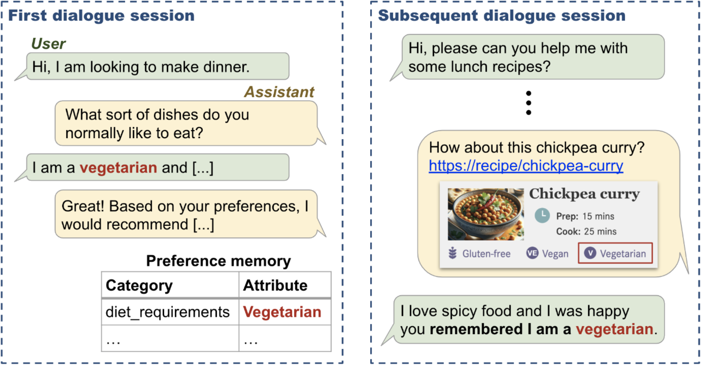
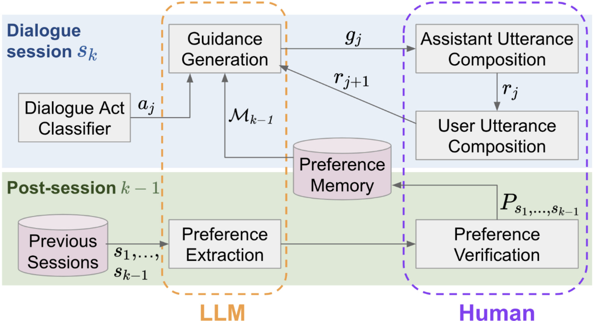

LAPS
====

<!-- This repository provides (1) conversational entity linking dataset (ConEL-2) and (2) conversational entity linking tool (CREL), as resources for the following research: -->

LAPS (LLM-Augmented Personalized Self-Dialogue) is a method for constructing personalized multi-session conversational search dialogues.
This repository contains the LAPS dataset and code for the method, as well as code for evaluating the dialogues.
These are resources for the following research:

- ***[Doing Personal LAPS: LLM-Augmented Dialogue Construction for Personalized Multi-Session Conversational Search](https://arxiv.org/abs/2405.03480)***, Hideaki Joko, Shubham Chatterjee, Andrew Ramsay, Arjen P. de Vries, Jeff Dalton, Faegheh Hasibi, SIGIR 2024.


This repository is structured in the following way:
<!-- 
- `tool/` : EL tool for conversation (CREL), with the example script.
- `dataset/` : Conversational entity linking datasets (ConEL-2), with the documentation of the statistics and format.
- `eval/` : Tool to calculate the performance of the entity linking method, with the run files of baseline and our method. -->

- `dataset/` : LAPS dataset, containing the recipe and movie domains with extracted actual user preferences.
- `dialogue_evaluation/` : Instructions and code for evaluating the dialogues.
- `method/` : Code for the LAPS method.
- `downstream/` : Instructions, trained models, and prompts for the preference extraction and personalized recommendation tasks.

# LAPS Dataset


<!--  -->


**Figure: An snippet from a multi-session dialogue in the recipe domain.**

## Dataset

Each topic has train, val, test, split, as well as a full dataset (`recipe_dataset.json` and `movie_dataset.json`).

**Table: Statistics of the LAPS dataset.**

| Domain | Split | #Single-Session | #Two-Session | #Three-Session | #Pref | #Utt | #Dial |
|--------|-------|-----------------|--------------|----------------|-------|------|-------|
| **Recipe** | **Train** | 163 | 24 | 160 | 5,538 | 9,342 | 691 |
|            | **Val**   | 24  | 5  | 21  | 772   | 1,333 | 97  |
|            | **Test**  | 48  | 10 | 41  | 1,600 | 2,610 | 191 |
|            | **Total** | **235** | **39** | **222** | **7,910** | **13,285** | **979** |
| **Movie**  | **Train** | 46  | 14 | 72  | 2,225 | 3,974 | 290 |
|            | **Val**   | 5   | 1  | 13  | 351   | 642   | 46  |
|            | **Test**  | 11  | 4  | 24  | 729   | 1,220 | 91  |
|            | **Total** | **62**  | **19** | **109** | **3,305** | **5,836** | **427** |

The JSON structure of the dataset is as follows:

- `worker_id`: A unique worker ID who handles the dialogue sessions. This can be used as uniq ID of the set of dialogue sessions.
- `topic`: Topic of the dialogue sessions; either "recipe" or "movie."
- `sessions`: An array of dialogue sessions, each containing the following keys:
  - `dialogue`: An array of messages that represent the back-and-forth conversation between the User and the Assistant. Each message object contains:
    - `role`: Either User or Assistant.
    - `turn_number`: A sequential number indicating the order of the message within the dialogue. Starts at 0.
    - `message`: The actual text content of the message.
  - `preferences`: key is a category of preferences (e.g., "cuisine") and value is a list of preferences (e.g., ["Italian", "Mexican"]).
  - `task_setting`: Indicates the task setting for which the User is seeking. (e.g., 'dinner', 'breakfast', 'lunch' for recipe topic)

## Evaluation Tool

The evaluation tool is provided in the `dialogue_evaluation/` directory.

- `./diversity/` contains the code for calculating the diversity scores (distinct-n, entropy-n, and Self-BLEU). See `diversity_results.ipynb` for how to run the code.
- `./quality/` contains the code for calculating the quality scores (Naturalness, Understandability, and Coherence) from the UniEval results. See `quality_results.ipynb` for how to run the code.

# Methods

## LAPS Method
LAPS (LLM-Augmented Personalized Self-Dialogue) method constructs diverse and personalized multi-session conversational search and recommendation dialogues.

The method employs an LLM to dynamically generate personal guidance for crowd workers, playing both user and assistant roles.
- **Guidance generation**: The guidance is generated based on the previously elicited user preferences and the current state of the dialogue, determined by a dialogue act classifier.
- **Utterance composition**: A single human agent composes the assistant response based on the LLM-generated guidance and then switches to the role of a user, providing a response to the previous utterance.
- **Preference extraction**: After each dialogue session, LAPS extracts preferences from the dialogue and stores them in a preference memory.
This memory is a key-value store about user preferences, analogous to the PKG and PTKB concepts.
<!-- 
More specifically, the method consists of four key elements as follows:
- (i) Dialogue act classification: Determines the assistant's next action that the assistant should take; e.g., request information, and recommend.
- (ii) Guidance generation: Generates guidance considering the dialogue history and the previously extracted preferences stored in the preference memory.
- (iii) Utterance composition: The human agent composes the assistant response based on the LLM-generated guidance, and then switches to the role of a user, providing a response to the previous utterance.
- (iv) Preference extraction: Preferences are extracted from the dialogue using an LLM and checked by the human agent. These preferences are stored in the preference memory and used in subsequent sessions for generating personalized guidance. -->

<!--  -->


`method/` contains the code for the LAPS method.
See `README.md` for the instructions.

## Preference Extraction and Personalized Recommendation

`downstream/` contains the instructions, trained models, and prompts for the preference extraction and personalized recommendation tasks.


# Citation and Contact

You can cite us using 

```
@inproceedings{Joko:2024:LAPS,
  author = {Joko, Hideaki and Chatterjee, Shubham and Ramsay, Andrew and de Vries, Arjen P. and Dalton, Jeff and Hasibi, Faegheh},
  title = {{Doing Personal LAPS: LLM-Augmented Dialogue Construction for Personalized Multi-Session Conversational Search}},
  booktitle = {Proc. of the 47th International ACM SIGIR Conference on Research and Development in Information Retrieval},
  series = {SIGIR '24},
  year = {2024}
}
```

If you have any questions, please contact Hideaki Joko at hideaki.joko@ru.nl